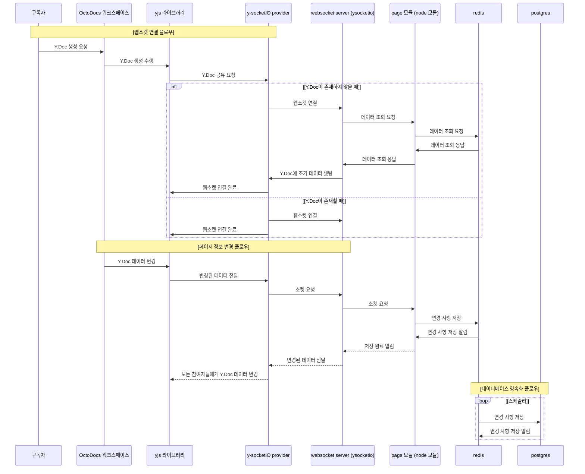

 

  
    
   

  <a href="#옥토독스소개">🐙 옥토독스 소개</a>  
  <a href="#주차별피드백">🌱 주차별 피드백을 통한 점진적 개선</a>  
  <a href="#프로젝트타임라인">🗺️ 프로젝트 타임라인</a>  
  <a href="#프로젝트구조">🛠️ 프로젝트 구조</a>  
  <a href="#문제와해결과정">🚧 문제와 해결과정</a>  
  <a href="#팀원소개">🧸 팀원 소개</a>  

  

<h1 id="옥토독스소개">🐙 옥토독스 소개</h1>

### 🕸️ 관계형 지식 관리 툴 

🌱 마크다운, 이미지, 코드 등을 활용해서 간편하게 **문서 작성**이 가능합니다.  
🌱 작성한 문서들을 **연결**하고 **배치**하면서 새로운 아이디어를 쉽게 떠올릴 수 있습니다.

https://github.com/user-attachments/assets/1ac81d56-a0ce-403c-9e3f-7ba092b6a5b6

 

### 🧸 실시간 동시 편집 및 협업 기능

🌱 에디터에서 간편하게 **실시간 동시 편집**이 가능합니다.  
🌱 작성된 문서들도 **함께 연결하고 배치**해 보며 우리 팀만의 구조를 만들어 볼 수 있습니다.

https://github.com/user-attachments/assets/86b0dcaf-3640-4836-8b91-207b39b17b05

 

### ⛺️ 워크스페이스 초대 기능

🌱 우리 팀만의 **워크 스페이스를 생성**하고 팀원들을 **초대**할 수 있습니다.  
🌱 워크 스페이스의 **공개 범위**를 설정해서 누구나 참여할 수 있는 공간도 생성이 가능합니다.

https://github.com/user-attachments/assets/0c096e40-bed4-4cee-bb8e-40f72a5d43f2

    

<h1 id="주차별피드백">🌱 주차별 피드백을 통한 점진적 개선</h1>

  

<h1 id="프로젝트타임라인">🗺️ 프로젝트 타임라인</h1>

  

<h1 id="프로젝트구조">🛠️ 프로젝트 구조</h1>

### 🖥️ System Architecture

 

### 🐳 Sequence Diagram 

  

<h1 id="문제와해결과정">🚧 문제와 해결과정</h1>

### 🐙 실시간 편집 구현 과정

실시간으로 여러 사용자가 동일한 문서를 편집할 때, 충돌 없이 동기화하는 것은 어려운 문제입니다. Octodocs 팀은 이를 직접 구현하는 대신 **YJS**와 **Socket.IO**를 결합하는 전략을 선택했습니다. 하지만 이 두 라이브러리를 통합하는 과정에서 예상치 못한 문제들을 어떻게 해결했을까요?

→ [🔗 실시간 편집의 비밀, 지금 바로 확인하기](https://github.com/boostcampwm-2024/web15-OctoDocs/wiki/%EC%8B%A4%EC%8B%9C%EA%B0%84-%ED%8E%B8%EC%A7%91-%EA%B5%AC%ED%98%84-%EA%B3%BC%EC%A0%95)

 

### 🌊 데이터 흐름 변경

Octodocs 팀은 기존 RESTful API 기반 상태 관리를 버리고 **YDoc 중심의 단일 Truth Source**와 **소켓 기반 단방향 흐름**으로 전환했습니다. 이로 인해 모든 상태가 YDoc을 통해 일관되게 관리되고, 데이터 흐름도 간소화되었습니다. 기존 방식을 버리고 이 변화를 선택한 이유는 무엇일까요? 또한, 중복 관리와 데이터 충돌을 줄이기 위한 **data flow 변화**의 핵심은 무엇이었을까요?

→ [🔗 데이터 흐름에 몸을 맡겨보기](https://github.com/boostcampwm-2024/web15-OctoDocs/wiki/%EC%86%8C%EC%BC%93%EC%9C%BC%EB%A1%9C-%EC%9D%B8%ED%95%9C-%EC%83%81%ED%83%9C%EA%B4%80%EB%A6%AC%EC%9D%98-%EB%B3%B5%EC%9E%A1%EC%84%B1%EA%B3%BC-%EB%8D%B0%EC%9D%B4%ED%84%B0-%ED%9D%90%EB%A6%84-%EB%B3%80%EA%B2%BD)

 

### 🕸️ FE 프로젝트 구조 개선 과정

짧은 기간의 스프린트를 빠르게 반복하여 개발했던 Octodocs 팀은 어느 순간부터 기능을 추가하고 유지보수하기 어렵다는 문제점을 마주하였습니다. 기존 **프로젝트 구조**의 문제점을 어떻게 파악했고, 어떤 방법으로 개선 했을까요?

→ [🔗 FSD, 힙하지만 막 갖다 쓰진 않았습니다](https://github.com/boostcampwm-2024/web15-OctoDocs/wiki/FE-%ED%94%84%EB%A1%9C%EC%A0%9D%ED%8A%B8-%EA%B5%AC%EC%A1%B0-%EA%B0%9C%EC%84%A0-%EA%B3%BC%EC%A0%95)

 

### ✨ 드래그 이벤트 발생 시 생기는 쿼리 최적화

노트 카드를 **드래그할 때 너무 많은 쿼리가 발생**해 서버가 멈추는 치명적인 문제가 있었습니다. 핵심 기능인 캔버스를 아예 이용할 수 없었기에, 반드시 해결해야 하는 과제였습니다. Octodocs 팀은 소수점 단위로 변하는 좌표를 DB에 저장하기 위해 어떤 최적화를 도입했을까요?

→ [🔗 우측으로 1mm만 옮겨주세요](https://github.com/boostcampwm-2024/web15-OctoDocs/wiki/%EB%8D%B0%EC%9D%B4%ED%84%B0-%EA%B4%80%EC%B0%B0%2C-%EC%BF%BC%EB%A6%AC-%EB%B0%9C%EC%83%9D-%EC%B5%9C%EC%A0%81%ED%99%94-%EA%B3%BC%EC%A0%95)

 

### 🧨 Redis를 활용한 데이터베이스 부하 줄이기

실시간으로 문서를 동시에 편집하면 굉장히 많은 변경 사항이 발생합니다. 누군가 타이핑을 할 때마다 변경 사항들을 모두 데이터베이스에 반영하기에는 부하가 너무 발생했기에, Octodocs 팀은 redis를 도입하기로 결정했습니다. 어떤 지점에서 redis 도입을 결정했고, 어떻게 redis를 활용하고 있을까요? 

→ [🔗 Redis 같은 걸 끼얹나?](https://github.com/boostcampwm-2024/web15-OctoDocs/wiki/redis%EB%A5%BC-%ED%86%B5%ED%95%B4-%EB%8D%B0%EC%9D%B4%ED%84%B0%EB%B2%A0%EC%9D%B4%EC%8A%A4-%EC%BF%BC%EB%A6%AC-%EC%A4%84%EC%9D%B4%EA%B8%B0)

 

### 🐳 개발 환경, 배포 환경 및 CI/CD에 대한 개선 과정

Octodocs 팀은 사용자 경험 향상은 물론, 일관된 코드 품질 유지와 개발자 친화적인 쾌적한 개발 환경 조성을 위해 많은 노력을 기울였습니다. 멀티 레포에서 모노레포로의 전환, GitHub Actions를 활용한 CI/CD 구축, Docker와 Docker Compose의 도입까지—우리는 어떤 변화를 거쳤을까요? 

→ [🔗 환경 개선의 여정 따라가기](https://github.com/boostcampwm-2024/web15-OctoDocs/wiki/%EA%B0%9C%EB%B0%9C-%ED%99%98%EA%B2%BD%2C-%EB%B0%B0%ED%8F%AC-%ED%99%98%EA%B2%BD-%EB%B0%8F-CI-CD%EC%97%90-%EB%8C%80%ED%95%9C-%EA%B0%9C%EC%84%A0-%EA%B3%BC%EC%A0%95)

  

<h1 id="팀원소개">🧸 팀원 소개</h1>

| [J032_김동준](https://github.com/djk01281) | [J075_김현준](https://github.com/Tolerblanc) | [J097_민서진](https://github.com/summersummerwhy) | [J162_유성민](https://github.com/ezcolin2) | [J248_진예원](https://github.com/yewonJin) |
|:----------------------------------------:|:------------------------------------------:|:------------------------------------------------:|:----------------------------------------:|:----------------------------------------:|
|  |  |  |  |  |
| **INFJ** | **INFJ** | **INTP** | **INFP** | **ISTJ** |
| **`FE`** | **`BE`** | **`BE`** | **`BE`** | **`FE`** |
